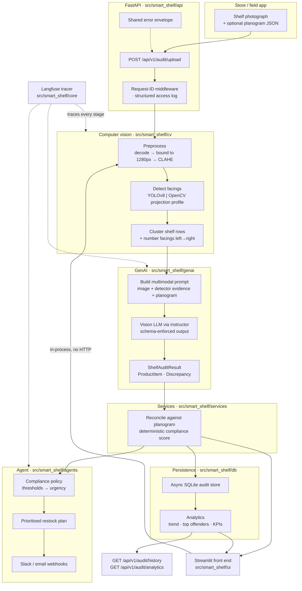
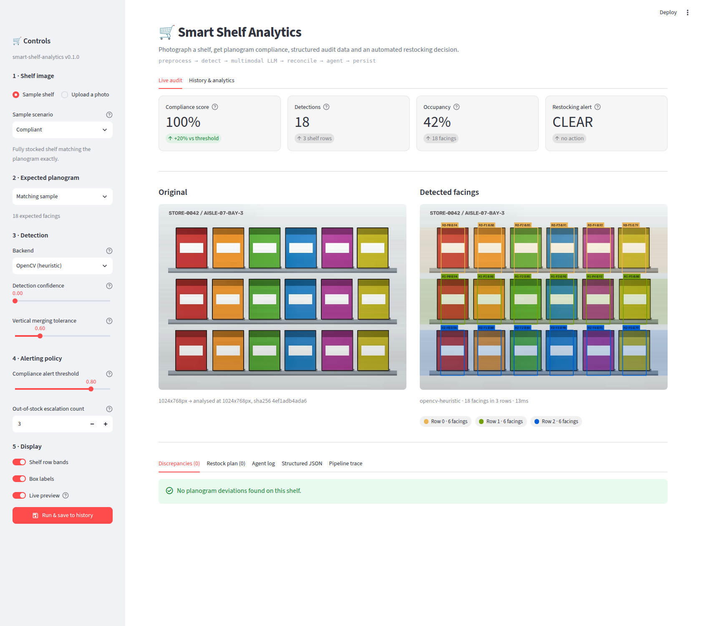

# Smart Shelf Analytics

**Automated retail shelf auditing: photograph in, planogram compliance and a restocking work order out.**

[](https://github.com/your-org/smart-shelf-analytics/actions/workflows/ci.yml)
[](https://www.python.org/)
[](https://docs.astral.sh/ruff/)
[](https://mypy-lang.org/)
[](https://docs.astral.sh/uv/)
[](https://streamlit.io/)
[](LICENSE)

---

## 1. Overview

Takes a shelf photograph and returns which SKUs are missing, how far the bay has
drifted from its planogram, and whether that warrants paging the shift lead. The
output is structured data, not free text, so it can be queried and trended.

The pipeline deliberately uses two kinds of model:

| Stage | Technology | Why this one |
| --- | --- | --- |
| Detection | YOLOv8/v11, or a dependency-free OpenCV pipeline | Counting objects is a geometry problem. A detector is cheap, fast and reproducible; an LLM asked to count facings drifts. |
| Understanding | Multimodal LLM with `instructor` + Pydantic v2 | Reading a shelf label, recognising a brand and judging "is this packaging damaged" is a language-and-vision problem no fixed-class detector solves. |
| Reconciliation | Deterministic Python | Compliance scores feed KPIs and bonuses. They must be identical on every rerun, so they are computed from the model's *observations*, never asked of the model. |
| Decision | Rule-based agent | Whether a human gets paged at 7am is a business rule that has to be auditable and tunable per chain. |

> **The default path runs offline.** The OpenCV detector and the deterministic
> auditor are the defaults, so the whole pipeline runs with no API key, no GPU,
> no model weights and no network calls. YOLO is installed too, but only
> downloads its checkpoint if you actually select that backend.

### Business value

| Problem | What this measures | What changes |
| --- | --- | --- |
| Out-of-stocks are found by customers, not staff | Per-SKU availability on every photo | Gaps are caught on the next photo instead of at the till |
| Planogram audits are manual and sampled | Every photographed bay is audited | Coverage moves from a sample to whatever staff photograph |
| Field reports are unstructured text | Typed `ShelfAuditResult` rows in SQL | Compliance trends, worst-offender SKUs, per-store league tables |
| Escalation is inconsistent | One policy, applied identically everywhere | Thresholds are configuration, not per-store habit |

---

## 2. Architecture



### Layering

Dependencies point inward only. `core` knows nothing about FastAPI; `genai` knows
nothing about SQLite; `api` knows nothing about OpenCV. Every seam is a `Protocol`
(`ObjectDetector`, `VisionLanguageEngine`, `Notifier`, `Tracer`), bound once in
[`api/dependencies.py`](src/smart_shelf/api/dependencies.py).

```
src/smart_shelf/
├── core/       config (pydantic-settings) · structlog · exceptions · Langfuse tracer
├── cv/         preprocessing · detector backends · shelf-row clustering
├── genai/      Pydantic v2 schemas · prompts · instructor engine · offline engine
├── services/   pipeline orchestration · deterministic planogram reconciliation
├── agents/     compliance policy · restock planning · Slack/email notifiers
├── db/         async SQLite repository · analytics queries
├── api/        FastAPI app · routers · middleware · error envelope
└── ui/         Streamlit front end · detection overlay · sync pipeline bridge
```

---

## 3. Quickstart

### Local

Requires Python 3.11+ and [uv](https://docs.astral.sh/uv/getting-started/installation/).

```bash
git clone https://github.com/your-org/smart-shelf-analytics.git
cd smart-shelf-analytics

make install          # .venv with the exact versions pinned in uv.lock
make sample-data      # synthetic shelf images, planograms and fixtures
make test             # 267 tests, no network required
make ui               # interactive front end on http://localhost:8501
make run              # REST API on http://localhost:8000/docs
```

<details>
<summary>Without <code>make</code></summary>

```bash
uv sync --locked --extra dev          # creates .venv from uv.lock
source .venv/bin/activate
python scripts/generate_sample_data.py --force
pytest
python -m smart_shelf --reload
```

</details>

<details>
<summary>Without <code>uv</code></summary>

pip cannot read `uv.lock`, so this re-resolves the dependency graph and may install
different versions than CI and the Docker image use. Fine for a quick look, not for
reproducing a bug report.

```bash
python -m venv .venv && source .venv/bin/activate
pip install -e ".[dev]"
```

</details>

### Install size

The base install includes `ultralytics`, which pulls in torch. On Linux that
means the CUDA wheels too, so a default environment is roughly 6 GB on disk.
Nothing else in the project needs torch, and the default detector backend does
not use it. If that matters for your CI or your image, the usual remedy is to
resolve torch from the PyTorch CPU index, which brings it down to a few hundred
megabytes:

```toml
[tool.uv.sources]
torch = [{ index = "pytorch-cpu" }]

[[tool.uv.index]]
name = "pytorch-cpu"
url = "https://download.pytorch.org/whl/cpu"
explicit = true
```

### Reproducible dependencies

`uv.lock` pins every transitive dependency - including the optional `llm`,
`obs`, `vector` and `ui` extras - with hashes, resolved universally across
Linux/macOS/Windows and Python 3.11 through 3.14. It is committed, and CI fails if it
drifts from `pyproject.toml`.

| Task | Command |
| --- | --- |
| Install exactly what is locked | `uv sync --locked --extra dev` |
| Add or change a dependency | edit `pyproject.toml`, then `make lock` |
| Upgrade one package | `uv lock --upgrade-package httpx` |
| Upgrade everything | `uv lock --upgrade` |
| Verify the lock is current | `make lock-check` |

Never hand-edit `uv.lock`. `make install` and the Docker build both refuse to
proceed if the lock and the manifest disagree.

### Docker

```bash
cp .env.example .env          # optional; every setting has a working default
docker compose up --build     # API on :8000, Qdrant on :6333

docker compose --profile ui up          # adds the Streamlit front end on :8501
```

The image is a multi-stage build: the builder runs `uv sync --locked` into
`/opt/venv` - the same pinned versions the test suite runs against - and the runtime
stage ships that virtualenv, a non-root user and a healthcheck. No compilers, no uv,
no lockfile in the final layer. Optional extras are selected with a build argument,
so the API image stays lean while the front-end image gets Streamlit:

```bash
docker build --target runtime -t shelf-api .
docker build --target runtime --build-arg UV_EXTRAS="--extra ui" -t shelf-ui .
```

### Enabling the real models

Everything below is optional; the defaults work without any of it.

```bash
uv sync --locked --extra llm                     # instructor + anthropic + openai
export SHELF_VLM_BACKEND=anthropic
export SHELF_ANTHROPIC_API_KEY=sk-ant-...
export SHELF_VLM_MODEL=claude-sonnet-5

# YOLO ships in the base install and defaults to an SKU-110K checkpoint,
# downloaded on first use and then served from the local cache.
export SHELF_DETECTOR_BACKEND=yolo       # or: hybrid
export SHELF_YOLO_WEIGHTS_DIR=~/.cache/smart-shelf-analytics/weights

uv sync --locked --extra obs                     # langfuse
uv sync --locked --extra ui                      # streamlit front end
export SHELF_LANGFUSE_ENABLED=true
export SHELF_LANGFUSE_PUBLIC_KEY=pk-lf-...
export SHELF_LANGFUSE_SECRET_KEY=sk-lf-...
```

### Detector backends

| `SHELF_DETECTOR_BACKEND` | What it does |
| --- | --- |
| `heuristic` (default) | OpenCV only. No weights, no network, deterministic. |
| `yolo` | SKU-110K checkpoint, fetched on first use. |
| `hybrid` | YOLO first; falls back to OpenCV if the weights are unavailable or YOLO returns fewer than `SHELF_HYBRID_MIN_DETECTIONS` facings. |

The default checkpoint is
[`chistopat/sku110k-yolo11-object-detector`](https://huggingface.co/chistopat/sku110k-yolo11-object-detector)
(YOLO11s, 640px), whose published SKU-110K test metrics are precision 0.913,
recall 0.867 and mAP50 0.927 over 431,419 instances. It predicts a single class,
`object`, which matches how this pipeline treats facings.

A stock COCO checkpoint such as `yolov8n.pt` is the wrong tool here: none of its
80 classes is "a packaged product on a shelf", and it returns zero detections on
retail imagery. It is still selectable by setting `SHELF_YOLO_WEIGHTS`.

Measured on a real supermarket aisle photograph (1600x1200, Wikimedia Commons,
CC BY-SA 3.0), counting detected facings:

| Backend | Facings found |
| --- | --- |
| OpenCV, before this work | 2 |
| OpenCV, with the dense-grid path | 11 |
| SKU-110K YOLO11s | 300 |

On the bundled six-row dense sample, where the ground truth is exactly 68
facings, the SKU-110K checkpoint returns 68 across all six rows and the OpenCV
backend returns 61.

See [`.env.example`](.env.example) for the full configuration surface. Every variable is
prefixed `SHELF_` and validated by [`core/config.py`](src/smart_shelf/core/config.py)
at startup - a bad value fails fast rather than at 3am.

---

## 4. Interactive front end

A Streamlit app drives the whole pipeline from a browser. It calls the service
layer in-process, so there is no API to start first.

```bash
make ui                        # or: streamlit run app.py
python -m smart_shelf.ui       # equivalent, from an installed package
smart-shelf-ui                 # console script
```



| Area | What it does |
| --- | --- |
| **Sidebar** | One-click sample shelves (no upload needed), or drop in your own photo; pick the planogram; switch detector backend between OpenCV and YOLO; tune detection confidence and vertical merging tolerance; set the alerting policy. |
| **Side-by-side view** | The original photograph next to the annotated one. Boxes are coloured per shelf row, with a translucent band showing the vertical extent the clustering assigned - so the merging tolerance is visible, not just numeric. |
| **Metric cards** | Compliance score against the threshold, detection count and shelf rows, occupancy, and the agent's restocking verdict. |
| **Detail tabs** | Discrepancy table, prioritised restock plan, the agent log with the exact Slack and email payloads it would have sent, the raw `ShelfAuditResult` JSON with a download button, and per-stage pipeline timings. |
| **History tab** | Compliance trend, alert rate and worst-offending SKUs across saved audits. |

Live preview re-audits on every control change (about 150 ms) without touching
the database; **Run & save to history** is the only action that persists a row.

The sidebar controls are real: raising detection confidence prunes facings, and
raising the merging tolerance collapses the three shelf rows into one. Both are
asserted in `tests/ui/`.

---

## 5. API

Interactive docs at `/docs`, OpenAPI at `/openapi.json`.

| Method | Path | Purpose |
| --- | --- | --- |
| `POST` | `/api/v1/audit/upload` | Audit one shelf image against an optional planogram |
| `GET` | `/api/v1/audit/history` | Past audits, filterable by compliance score, store, alert flag and time |
| `GET` | `/api/v1/audit/analytics` | Compliance trend, alert rate and worst-offending SKUs |
| `GET` | `/api/v1/audit/{audit_id}` | One stored audit |
| `GET` | `/health` | Per-component health; `503` when a required component is down |

### Audit a shelf

```bash
curl -X POST http://localhost:8000/api/v1/audit/upload \
  -F "image=@data/sample_data/images/shelf_critical_stockout.jpg" \
  -F "planogram_file=@data/sample_data/planograms/shelf_critical_stockout.json;type=application/json" \
  -F "store_id=STORE-0042" \
  -F "shelf_id=AISLE-07-BAY-3"
```

`planogram_file` takes an uploaded `.json` file; `planogram` takes the same document
inline as a form field:

```bash
curl -X POST http://localhost:8000/api/v1/audit/upload \
  -F "image=@shelf.jpg" \
  -F 'planogram={"store_id":"STORE-0042","entries":[{"sku":"SKU-1001","name":"Aurora Sparkling Water 500ml","shelf_level":0,"position_index":0,"expected_facings":2,"min_facings":1}]}'
```

Omit it entirely to run an availability-only audit (gaps, empty slots, missing price
labels).

<details open>
<summary><strong>201 Created</strong> (abridged)</summary>

```json
{
  "audit_id": "6f1d5c3e-3a1e-4f0f-9f2a-9a7c6f1f7a11",
  "created_at": "2026-09-22T09:15:02.441Z",
  "compliance_score": 0.5,
  "alert_triggered": true,
  "duration_ms": 147.6,
  "detection": {
    "backend": "opencv-heuristic",
    "detection_count": 11,
    "shelf_rows": 3,
    "mean_confidence": 0.8798,
    "occupancy_ratio": 0.2448,
    "duration_ms": 8.3
  },
  "result": {
    "store_id": "STORE-0042",
    "shelf_id": "AISLE-07-BAY-3",
    "category": "ambient grocery",
    "products": [
      {
        "sku": "SKU-1001",
        "name": "Aurora Sparkling Water 500ml",
        "brand": "Aurora",
        "category": "beverages",
        "facings": 1,
        "shelf_level": 0,
        "position_index": 0,
        "stock_state": "in_stock",
        "price_label_visible": true,
        "confidence": 0.72
      },
      {
        "sku": "SKU-3003",
        "name": "Rye Crackers 200g",
        "brand": "Fjordbake",
        "category": "snacks",
        "facings": 0,
        "shelf_level": 2,
        "position_index": 2,
        "stock_state": "out_of_stock",
        "price_label_visible": false,
        "confidence": 0.6
      }
    ],
    "discrepancies": [
      {
        "discrepancy_type": "incorrect_facings",
        "severity": "high",
        "sku": "SKU-1001",
        "product_name": "Aurora Sparkling Water 500ml",
        "shelf_level": 0,
        "expected": "2 facings",
        "observed": "1 facing",
        "description": "Aurora Sparkling Water 500ml (SKU-1001) shows 1 of 2 expected facings on shelf level 0.",
        "recommended_action": "Restock 1 facing of SKU-1001.",
        "confidence": 0.7
      },
      {
        "discrepancy_type": "out_of_stock",
        "severity": "high",
        "sku": "SKU-3003",
        "product_name": "Rye Crackers 200g",
        "shelf_level": 2,
        "expected": "2 facings",
        "observed": "0 facings",
        "description": "Rye Crackers 200g (SKU-3003) shows 0 of 2 expected facings on shelf level 2.",
        "recommended_action": "Restock 2 facings of SKU-3003.",
        "confidence": 0.7
      }
    ],
    "compliance_score": 0.5,
    "shelf_occupancy": 0.2448,
    "empty_slot_count": 3,
    "summary": "Detected 11 facings across 3 shelf rows against a planogram of 18 expected facings. 6 deviations require attention.",
    "captured_at": "2026-09-22T09:15:02.440Z",
    "total_facings": 9,
    "max_severity": "high"
  },
  "agent": {
    "alert_triggered": true,
    "urgency": "immediate",
    "reasons": [
      "compliance score 0.50 is below the 0.80 threshold",
      "3 out-of-stock SKUs (escalation threshold is 3)"
    ],
    "notified_channels": [
      "log"
    ],
    "tasks": [
      {
        "sku": "SKU-1001",
        "product_name": "Aurora Sparkling Water 500ml",
        "shelf_level": 0,
        "action": "Restock 1 facing of SKU-1001.",
        "severity": "high"
      }
    ]
  }
}
```

</details>

### Query the history

```bash
# Every shelf that failed compliance, worst first
curl "http://localhost:8000/api/v1/audit/history?max_compliance_score=0.8&limit=20"

# One store, alerts only, since the start of the month
curl "http://localhost:8000/api/v1/audit/history?store_id=STORE-0042&alert_triggered=true&since=2026-09-01T00:00:00Z"

# Dashboard aggregates
curl "http://localhost:8000/api/v1/audit/analytics?trend_days=30&top_n=10"
```

```json
{
  "items": [
    {
      "audit_id": "6f1d5c3e-3a1e-4f0f-9f2a-9a7c6f1f7a11",
      "created_at": "2026-09-22T09:15:02.441Z",
      "store_id": "STORE-0042",
      "shelf_id": "AISLE-07-BAY-3",
      "compliance_score": 0.5,
      "shelf_occupancy": 0.2448,
      "discrepancy_count": 6,
      "product_count": 9,
      "empty_slot_count": 3,
      "max_severity": "high",
      "alert_triggered": true,
      "detector_backend": "opencv-heuristic",
      "vlm_backend": "mock-vlm",
      "summary": "Detected 11 facings across 3 shelf rows\u2026"
    }
  ],
  "total": 1,
  "limit": 20,
  "offset": 0
}
```

### Errors

Every non-2xx response uses one envelope, and `request_id` matches the
`X-Request-ID` response header and the structured logs.

```json
{
  "error": {
    "code": "invalid_image",
    "message": "payload is not a decodable image (expected JPEG/PNG/WebP)",
    "details": {}
  },
  "request_id": "9d4b6f2a1c0e4f8ab2d6e0f1a3c5b7d9"
}
```

| Code | Status | Meaning |
| --- | --- | --- |
| `validation_error` | 422 | Request body or query parameters failed schema validation |
| `invalid_request` | 422 | Parameters are individually valid but mutually inconsistent |
| `invalid_image` | 422 | Upload is empty, oversized, or not a decodable image |
| `audit_not_found` | 404 | No audit with that id |
| `detection_failed` | 502 | The detection backend failed |
| `vlm_failed` | 502 | The vision-language model failed or returned unusable output |
| `internal_error` | 500 | Unexpected failure; details are logged, never returned |

---

## 6. Data for testing and evaluation

### Synthetic data (ships with the repository)

`data/sample_data/` is produced by [`scripts/generate_sample_data.py`](scripts/generate_sample_data.py)
and regenerated with `make sample-data`. Output is deterministic - same seed, same
bytes - so CI can assert exact detection counts.

```
data/sample_data/
├── images/           shelf_compliant.jpg · shelf_minor_gaps.jpg · shelf_critical_stockout.jpg
├── planograms/       expected layout per scenario (Planogram schema)
├── fixtures/         hand-written golden ShelfAuditResult per scenario
└── manifest.json     seed + scenario index
```

| Scenario | Empty slots | Expected detections | Compliance |
| --- | --- | --- | --- |
| `shelf_compliant` | 0 | 18 | 1.00 |
| `shelf_minor_gaps` | 2 | 16 | 0.83 |
| `shelf_critical_stockout` | 7 | 11 | 0.50 |
| `shelf_dense_6row` | 4 | 61 (OpenCV) / 68 (YOLO) | 0.94 |

Add a scenario by appending to `SCENARIOS` in the generator; images, planogram and
golden fixture are all derived from that one declaration.

### Public datasets (for real evaluation)

Synthetic cartons prove the plumbing, not the accuracy. For that, use a public
dense-retail dataset.

**SKU-110K**: 11,762 supermarket shelf photos, 1.7M box annotations, no class labels
(every object is "object"), which is exactly the facing-counting task here.

```bash
# 1. Download (~13 GB) from the official release
#    https://github.com/eg4000/SKU110K_CVPR19
mkdir -p data/raw && cd data/raw
curl -LO http://trax-geometry.s3.amazonaws.com/cvpr_challenge/SKU110K_fixed.tar.gz
tar -xzf SKU110K_fixed.tar.gz

# 2. Convert the CSV annotations to YOLO format
#    columns: image_name,x1,y1,x2,y2,class,image_width,image_height
python - <<'PY'
from pathlib import Path
import csv, collections
root = Path("data/raw/SKU110K_fixed")
for split in ("train", "val", "test"):
    rows = collections.defaultdict(list)
    with (root / "annotations" / f"annotations_{split}.csv").open() as fh:
        for name, x1, y1, x2, y2, _cls, w, h in csv.reader(fh):
            x1, y1, x2, y2, w, h = map(float, (x1, y1, x2, y2, w, h))
            rows[name].append(
                f"0 {((x1 + x2) / 2) / w:.6f} {((y1 + y2) / 2) / h:.6f} "
                f"{(x2 - x1) / w:.6f} {(y2 - y1) / h:.6f}"
            )
    out = root / "labels" / split
    out.mkdir(parents=True, exist_ok=True)
    for name, lines in rows.items():
        (out / f"{Path(name).stem}.txt").write_text("\n".join(lines))
PY

# 3. Fine-tune and point the service at the weights
yolo detect train model=yolov8m.pt data=sku110k.yaml imgsz=1280 epochs=50
export SHELF_DETECTOR_BACKEND=yolo
export SHELF_YOLO_WEIGHTS=runs/detect/train/weights/best.pt
```

Other useful sources: **Grocery Store Dataset** (5,125 images, 81 fine-grained classes
- good for the VLM's product-recognition half), **RP2K** (2,000 SKUs, ~384k images),
and **Freiburg Groceries** (25 coarse categories, small enough to iterate on).

SKU-110K carries no planograms, so generate them from the ground truth: cluster the
boxes into rows, assign synthetic SKUs, and delete a controlled fraction to create
known out-of-stocks. That gives labelled compliance scores to evaluate against.

---

## 7. Development

```bash
make help          # list every target
make test          # whole suite
make test-unit     # fast loop, no I/O
make test-api      # HTTP-level tests
make test-ui       # Streamlit front-end tests
make cov           # coverage report in htmlcov/
make lint          # ruff check + format --check
make typecheck     # mypy strict
make lock-check    # uv.lock matches pyproject.toml
make check         # everything CI runs
make fmt           # autofix and format
pre-commit install # gate every commit
```

Tests are split by cost and scope:

| Directory | Marker | Scope |
| --- | --- | --- |
| `tests/unit/` | `unit` | Pure functions and single classes, no I/O |
| `tests/integration/` | `integration` | Repository, analytics and the full pipeline against in-memory SQLite |
| `tests/api/` | `api` | HTTP contract through `httpx.ASGITransport` |
| `tests/ui/` | `ui` | The Streamlit app driven through Streamlit's `AppTest` harness |

CI ([`.github/workflows/ci.yml`](.github/workflows/ci.yml)) runs on every push to
`main`/`develop`, every pull request, and on demand:

| Job | What it does |
| --- | --- |
| `lockfile` | `uv lock --check`, which fails if `uv.lock` drifts from `pyproject.toml` |
| `quality` | `ruff check`, `ruff format --check`, `mypy --config-file mypy.ini` |
| `test` | Regenerates the sample data and asserts it is byte-identical, then runs pytest with coverage on Python 3.11, 3.12 and 3.13 |
| `docker` | Builds the runtime image and smoke-tests `/health` inside the container |

Every job installs with `uv sync --locked`, and `UV_FROZEN=1` is set workflow-wide,
so a run can never quietly resolve a dependency set that differs from the lockfile.

### Conventions

- Every module, public class and public function carries a docstring; `ruff` enforces it.
- No `Any` without a comment explaining the vendor boundary that forced it.
- New collaborators are `Protocol`s bound in `api/dependencies.py`, never imported concretely by callers.
- Domain failures subclass `SmartShelfError` and declare their own status code; handlers stay dumb.
- Nothing reads `os.environ` outside `core/config.py`.

---

## 8. License

MIT. See [LICENSE](LICENSE).
